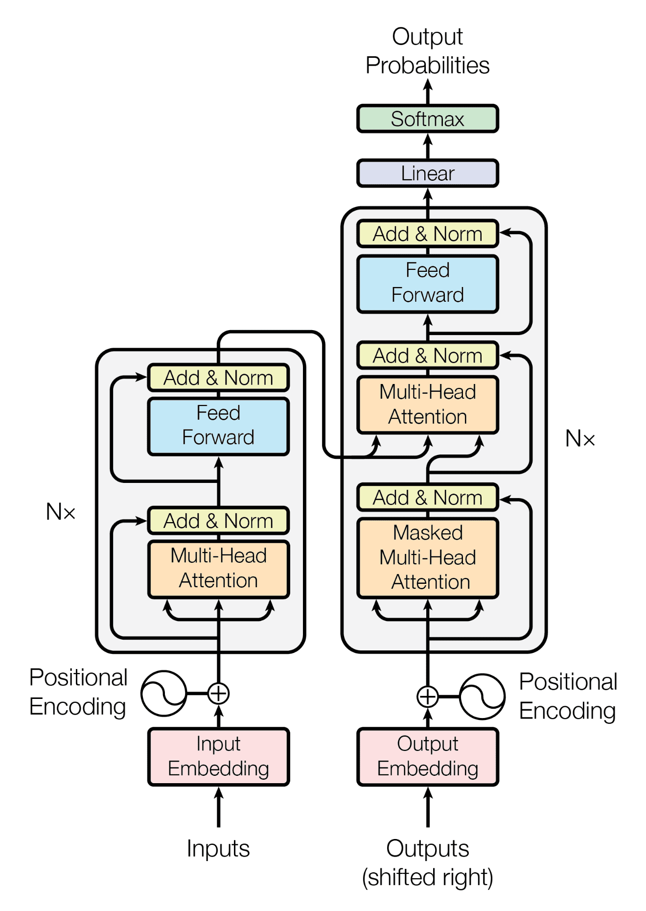

# Transformer Learning
  

Transformer architecture might be the most important invention in computer field(natural language processing) these years. becoming the backbone of various cutting-edge NLP applications. 

## ToDo
- [ ] Read the paper - attention is all you need
- [ ] Finish the pratice

### Source
- [Medium - Drawing the Transformer Network from Scratch](https://towardsdatascience.com/drawing-the-transformer-network-from-scratch-part-1-9269ed9a2c5e)  
- [Visualizing and Explaining Transformer Models From the Ground Up](https://deepgram.com/learn/visualizing-and-explaining-transformer-models-from-the-ground-up)

